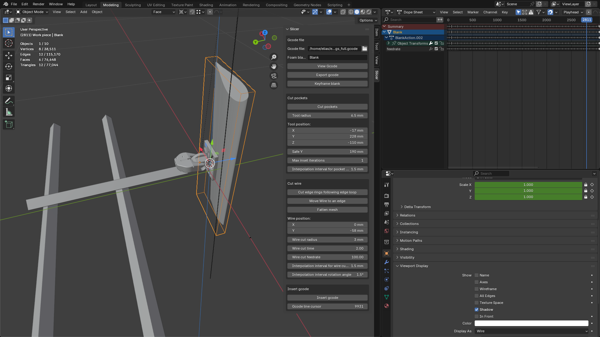

Blender 3D addon that acts  as a slicer for hot wire cutting robot.

The robot cuts foam with a hot wire by holding the foam piece and moving it against stationary hot wire. The robot can translate on XY axis and rotate the workpiece on 2 additional axis. The slicer computes the robot's toolpaths and generates gcode based on Blender 3d model.

Basic principle followed by the slicer is to cut one face of a polygon model at a time following series of faces defined by edge rings and loops. A face is cut by rotating and transating the object in such a way that the wire will run along 2 edges of a quad face. Compensation for wire cutting width is done by pre-fattening the model. The slicing program first generates the toolpaths as keyframes in Blender animation system, after which the keyframes are converted to gcode. This enables easy manual tweaking of particular moves if necessary.

Bulk of the slicing logic relating to how to position the wire relative to the workpiece lives in cut_wire.py, specificaly the following methods:

* move_to_opposing_edge
* interpolate_edges_across_quad
* rotate_edge_to_z_axis

.
